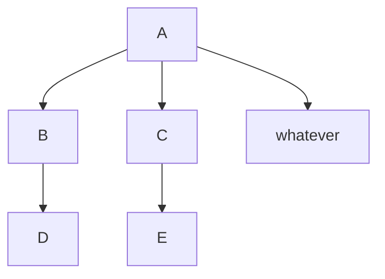

# XPRSS — A fast, unopinionated, minimalist web framework for PHP.



The first version of this framework is a direct clone of [express-php](https://github.com/aeberdinelli/express-php), which tries to clone the NodeJS [ExpressJS framework](https://www.npmjs.com/package/express) writing style. It does not have an event loop, it just mimics the method and helpers names that ExpressJS offers.

## Install
**Note**: To run XPRSS you need PHP >= 7.0 and Apache.

[ ] install w/ composer
[ ] vs do it manually
```
composer require hxgf/xprss:0.0.3@dev
```


Then, copy the .htaccess to the root of your site:

```
cp vendor/hxgf/xprss/.htaccess ./.htaccess
```

(if you don't want to copy, put this in a new .htaccess file)

```
RewriteEngine on
RewriteCond %{REQUEST_FILENAME} !-f
RewriteCond %{REQUEST_FILENAME} !-d
RewriteRule ^(.*)$ /index.php?route=$1 [L,QSA]
```

(you can also do it for nginx)

```
location / {
  if (!-e $request_filename){
    rewrite ^(.*)$ /index.php?route=$1 break;
  }
}
```

## Usage / DEMO example init

here's a quick example of how to initialize. if you're interested in more boilerplate check out [the docs] for more options and also the [index.php file in the app] contains a full example and also also [create-xprss-app] for a reasonable boilerplate starter kit thing

[ ] initializing w/ composer
[ ] vs doing it manually

```php
<?php
include __DIR__.'/vendor/autoload.php';

use XPRSS\Application;
use XPRSS\Router;

$app = new Application();
$router = new Router();

$router->get('/', function($req, $res) {
	$res->send('<h1>Hello Cleveland!</h1>');
});

$app->listen($router);
?>
```

## Routes
Routes are handled using a Router instance, for example:

```php
$router = new Router();
$router->get('/', function($req, $res) {
    // This will be called when someone goes to the main page using GET method.
});
```

You can handle post requests as well using post() instead of get(). Same for put() and delete().

## Route with dynamic parameters
You can route dynamic URL using parameters, for example:

```php
$router = new Router();
$router->get('/:something/:else', function($req, $res) {
    /**
     * Now let's imagine someone enters to URL: /hello/bye, then:
     *
     * $req->params->something will contain 'hello'
     * $req->params->else will contain 'bye'
     */
});
```

## Responses
If you're developing an API for example, you can send json simply doing:

```php
$router->post('/', function($req, $res) {
	$res->json(array(
		'error'		=> false,
		'message'	=> 'Hello'
	));
});
```

You can also send a custom http response code using:

```php
$router->post('/', function($req, $res) {
	$res->status(201)->json({
		'error'		=> false,
		'message'	=> 'Created!'
	});
});
```

**TIP**: There are a few more examples in the `index.php` file in this repository.

## Static files
If you wish to serve static files (likes images, html only) you can use:

```php
// If you visit /static/image.png, this will return the file views/public/image.png
$router->use('/static', $app->static('views/public'));
```

## Template engines
You're on your own for templating...at some point we'll have a guide for how to support various template engines (jade/pug, handlebars, twig, etc)

We'd like to to be as easy as:

```php
// Configure the engine to Pug
$app->set('view engine','pug');

// Jade was renamed to Pug, but we recognize it ;)
$app->set('view engine','jade');

// Or Mustache
$app->set('view engine','mustache');

// Set the path to the template files
$app->set('views','./views/pug');

// Now you can do something like this
$router->get('/', function($req, $res) {
	$res->render('index.jade');
});

// Or this
$router->get('/users/:username', function($req, $res) {
	$res->render('index.jade', array(
		'name'	=> $req->params->username
	));

	// Now in jade, you can use #{name} to get that variable!
});

```


## Request info
- You have the body of the request in $res->body no matter if you re handling POST or PUT.
- You have the query string under $req->query
- You have the cookies in $req->cookies
- You have all the request headers in $req->headers
